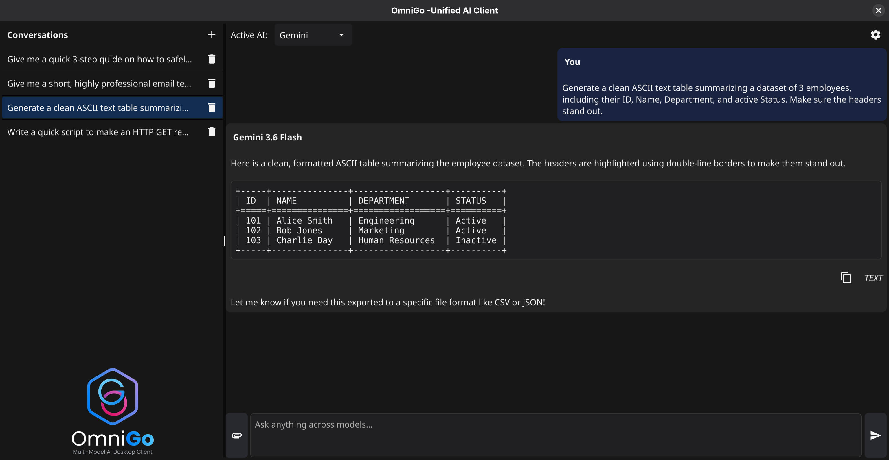
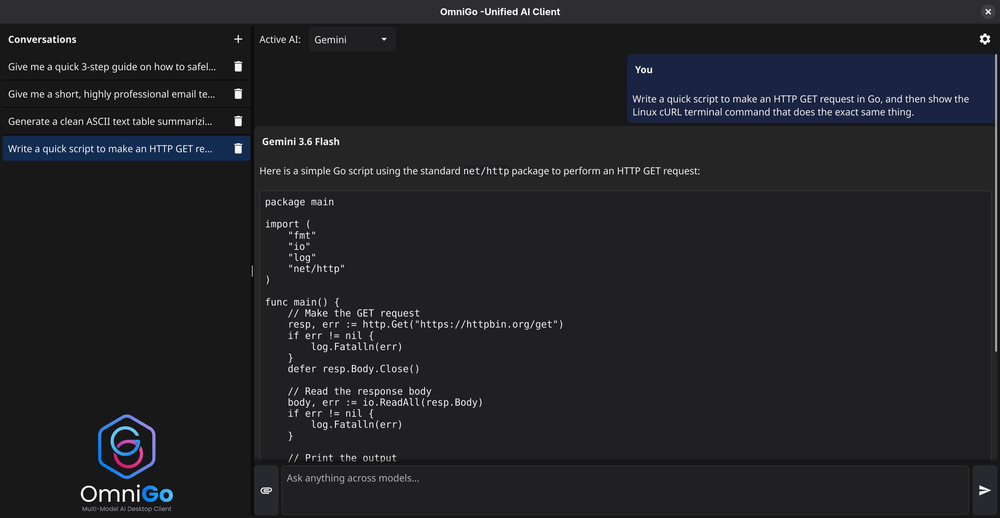

# OmniGo 🚀

OmniGo is a lightweight, blazing-fast, multi-model AI desktop chat client built natively in **Go** using the **Fyne** GUI toolkit framework. Designed primarily for Linux desktops, OmniGo's cross-platform architecture allows it to compile flawlessly for Windows and macOS with zero codebase changes.

By breaking away from heavy web-engine wrappers like Electron or WebViews, OmniGo delivers sub-millisecond native Markdown rendering, localized secure credential sandboxing, and smooth virtualized multi-session sidebar management.



---

## ✨ Features



- **Multi-Provider Architecture**: Seamlessly alternate backends between Google Gemini 3.6 and OpenAI ChatGPT via structural decouple layers.
- **Virtualized Sidebar Navigation**: Powered by a high-performance recycled `widget.List` to seamlessly scroll thousands of past chat interactions smoothly.
- **Native Markdown Viewer**: Renders titles, code blocks, lists, and formatted data payloads instantly using native canvas elements (`widget.NewRichTextFromMarkdown`).
- **Cross-Platform Secure Storage**: Leverages internal operating system hooks (`~/.config`, AppData, or macOS Sandboxes) to store sensitive API credentials safely out of sight.
- **Dynamic Session Instantiation**: Instantly spin up, track, and clear independent structural chat rooms utilizing the interactive sidebar assembly buttons.

---

## 🛠️ Architecture Deep-Dive (For Go Beginners)

OmniGo is designed to be highly modular. Instead of hardcoding vendor-specific client rules inside the UI event loop hooks, it relies on Go **Interfaces** to separate the user interface from the network API layer:

```go
// The engine contract that wraps all external service calls
type AIClient interface {
	GenerateResponse(ctx context.Context, prompt string, attachmentPath []string, onTokenChunk func(string)) error
}
```

This pattern makes it incredibly easy to expand the application. If you want to add support for a new model (like Anthropic Claude or an Ollama local instance), you simply write a structure that fulfills this contract without needing to modify your Fyne layout rendering code.

---

## 🚀 Getting Started

### 1. Prerequisites
Ensure you have [Go (1.26 or higher)](https://go.dev) installed on your system. 

If you are on **Linux**, ensure your system has the standard developer headers for graphics compilation installed:
```bash
# Ubuntu/Debian
sudo apt install libgl1-mesa-dev xorg-dev libx11-dev libxrandr-dev libxi-dev libxcursor-dev libxinerama-dev

# Fedora/RHEL
sudo dnf groupinstall "Development Tools"
sudo dnf install mesa-libGL-dev libX11-devel libXrandr-devel libXi-devel libXcursor-devel libXinerama-devel
```

### 2. Installation & Setup
Clone the workspace and initialize your local module definitions:

```bash
git clone https://github.com/tamer-badawy/OmniGo.git
cd OmniGo

# Initialize dependencies 
go mod tidy
```

### 3. Running Locally
Run the source file immediately using the Go toolchain:
```bash
go run main.go
```

---

## 🧰 How to Configure API Keys

OmniGo does not save or log your private access keys over open public networks. 

1. Launch OmniGo and locate the **Gear Icon (⚙️)** in the top right corner.
2. Click it to bring up the isolated **Secure Credentials Registry Panel**.
3. Paste your active tokens from your [Google AI Studio](https://aistudio.google.com) or [OpenAI Platform](https://openai.com) accounts.
4. Click **Save**. OmniGo encrypts/stores the preferences profile path natively inside your standard user workspace registry layout.

---

## 📦 Cross-Platform Compiling

Want to package OmniGo into a standalone executable application binary for your friends or external machines? Use Go's built-in target cross-compilation environment bindings directly in your terminal:

```bash
# Compile native binary for Linux
go build -o omnigo main.go

# Cross-compile for Windows (Produces omnigo.exe)
GOOS=windows GOARCH=amd64 go build -o omnigo.exe main.go

# Cross-compile for macOS (Intel-based Macs)
GOOS=darwin GOARCH=amd64 go build -o omnigo_intel main.go

# Cross-compile for macOS (Apple Silicon M1/M2/M3 Macs)
GOOS=darwin GOARCH=arm64 go build -o omnigo_apple main.go
```

---

## 🤝 Contributing
Contributions are welcome! If you want to add new AI providers, themes, or streaming mechanics:
1. Fork the project repository.
2. Create a feature branch (`git checkout -b feature/AmazingFeature`).
3. Commit your variations (`git commit -m 'Add some AmazingFeature'`).
4. Push to the branch (`git push origin feature/AmazingFeature`).
5. Open a Pull Request.

---

## 📄 License
Distributed under the Apache-2.0 License. See `LICENSE` for more information.
